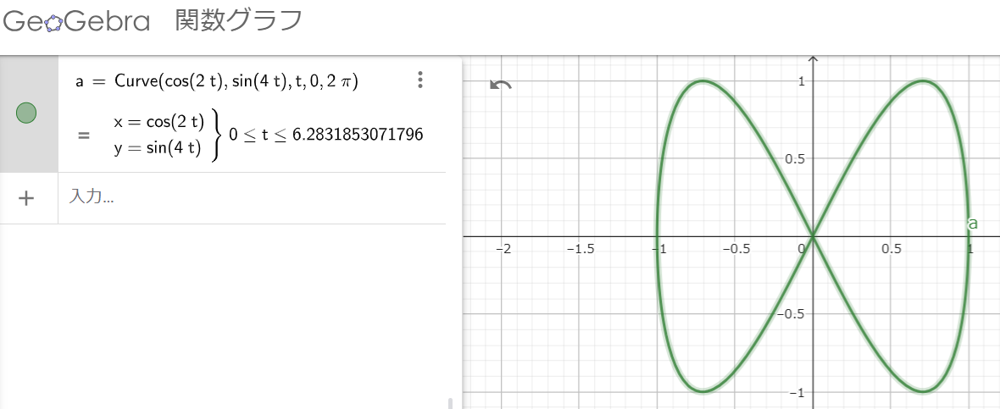
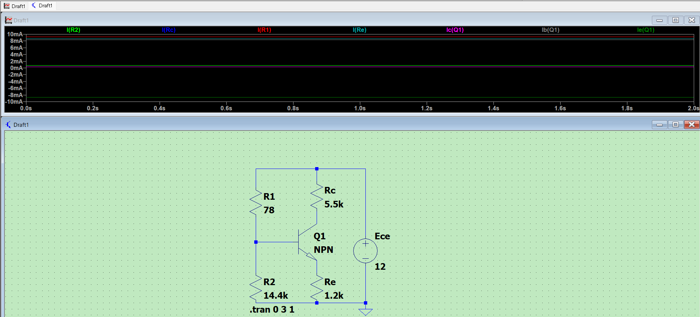

# LT SPICE

## 課題 1

### 結果

青:$I_{C1}$, 緑:$V_{C1}$

### 考察

$C1$を流れる電流$I_{C1}$の位相は、
$$ \dot I*{C1} = \frac{\dot V*{C1}}{\dot Z*{C1}} = \frac{V*{C1}}{-j\omega C1}=\frac{V*{C1}}{\omega C1}\angle(\theta*{V*{C1}}+\frac{\pi}{2})$$
より$C1$にかかる電圧$V*{C1}$より$\frac{\pi}{2}$進んでいることになる。
波形を見ても、$I*{C1}$の波形は$V*{C1}$の波形より$\frac{1}{4}$周期早いので、正しい結果が得られている。

## 課題 2

### 結果

青: I(L1)、緑: I(R1)
水色: V(NL)、赤: V(NS)

### 考察

一枚目では抵抗を逆向きにつないでいたらしい。
向きを直すと、電流の波形は一致した。直列なので当然である。

また、電圧の波形の位相は、
$$V_{NS}=\dot IR=IR\angle\theta_I $$
$$V*{NL}=\dot I\*j\omega L=I\omega L\angle(\theta_I+\frac{\pi}{2}) $$
より$V*{NL}$のほうが$\frac{\pi}{2}$進んでいる。

波形を見ても$V_{NL}$のほうが$\frac{1}{4}$周期早いので、正しい結果が得られている。

## 課題 3

### 結果

### 考察

横軸を w2、縦軸を w1 でとっているので、
$$x=cos(2t)$$
$$y=sin(4t)$$
のリサージュ曲線が現れている

## 課題 3+

### 結果

$$x=cos(3t)$$
$$y=sin(4t)$$

## 追加課題

電流帰還バイアス回路

